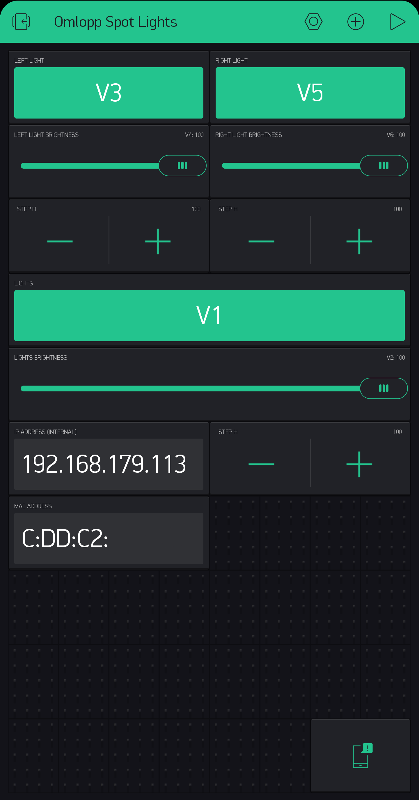

### Setup

**Using Local Blynk server** (for infinite energy): Setup Blynk Server (e.g. Docker container) && Client (e.g. Smartphone), see Blynk docs  
**Using Blynk cloud** (may be pricey): Register an account at blynk to use its credentials  
  
- Clone this repo
- Edit all `<Something>_example.h` files to contain real credentials
- Remove the `_example` suffix of said files
- Upload the sketch to ESP32
- Local server only: Create a UI with virtual pins matching the attached Image or  
  copy/insert json snippet from /Client/Android_IOS/....user into your blynk .user file
- Fill the token stuff with your own and connect Android/IOS app to (local) blynk server
- Control the lights using blynk client

### Physical components of this system

- IKEA OMLOPP LED spotlight (24 Volt DC LED Lamp), can be any light, but needs voltage adjustment (see Hardware sketch)
- ESP32 Devkit (Development board with ESP32 Microprocessor)
- L298N (motor controller board (H-Bridge))
- LM2596 (DC to DC Step-up Voltage Converter)
- Any 5V Power source, providing enough Amps

### Components replaced

- IKEA OMLOPP Power Supply & RF Receiver
- Remote Control (2.4GHz RF Transmitter)

### Software to control the system

- Blynk (App for Android/IOS)

